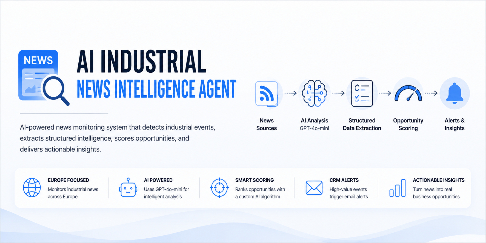
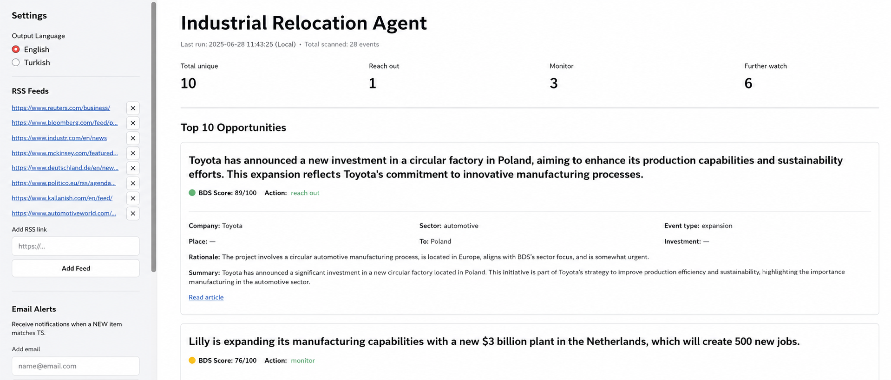

<p align="center">
  
</p>

<h1 align="center">AI Industrial News Intelligence Agent</h1>

<p align="center">
  An autonomous AI agent that monitors European industrial news, extracts structured business intelligence with an LLM, scores each opportunity, and delivers actionable leads through a live dashboard and automated email alerts.
</p>

<p align="center">
  
  
  
  
  
</p>

<p align="center">
  Developed during an internship at <b>Pro Sicht AI Software R&D and Project Consulting Inc.</b>
</p>

---

## Table of Contents

- [Overview](#-overview)
- [Features](#-features)
- [Tech Stack](#-tech-stack)
- [How It Works](#-how-it-works)
- [Opportunity Scoring](#-opportunity-scoring)
- [Project Structure](#-project-structure)
- [Installation](#%EF%B8%8F-installation)
- [Usage](#-usage)
- [Supported Event Types](#-supported-event-types)
- [Screenshots](#-screenshots)
- [Future Improvements](#-future-improvements)
- [Acknowledgments](#-acknowledgments)
- [License](#-license)

---

## 🚀 Overview

The **AI Industrial News Intelligence Agent** continuously monitors European industrial news sources to surface business opportunities — factory relocations, plant closures, manufacturing investments, facility expansions, and supply chain changes — as they happen.

Rather than just collecting articles, the system uses **OpenAI GPT-4o-mini** to extract structured event data, classify the event type, generate a concise summary, and calculate an AI-driven **Opportunity Score (0–100)** that estimates the business value of each lead.

High-scoring opportunities automatically trigger email notifications, simulating a real CRM lead-generation workflow — turning a stream of raw news into a prioritized action list.

---

## ✨ Features

- 🤖 **AI-powered extraction** — structured event data pulled from raw articles using GPT-4o-mini
- 📰 **Automated RSS monitoring** across multiple configurable feeds
- 📊 **AI-driven opportunity scoring** (0–100) across five weighted business criteria
- 🌍 **Europe-focused filtering** to keep results relevant to the target market
- 🔄 **URL & content-based deduplication** so the same event is never reported twice
- 📝 **AI-generated summaries** for fast human review
- 📈 **Interactive Streamlit dashboard** with sortable, filterable results
- 📧 **Automatic email alerts** for high-priority opportunities
- 🗄 **PostgreSQL integration** for persistent, queryable storage
- 🌐 **English / Turkish interface** toggle

---

## 🛠 Tech Stack

| Category | Technology |
|---|---|
| Programming Language | Python 3.10+ |
| AI / LLM | OpenAI GPT-4o-mini |
| RSS Parsing | feedparser |
| Web Scraping | requests + BeautifulSoup4 |
| Dashboard | Streamlit |
| Database | PostgreSQL |
| Email | Gmail SMTP |
| Environment / Config | python-dotenv |

---

## 🔍 How It Works

1. **Fetch** — RSS feeds are polled on a schedule and new articles are pulled in.
2. **Deduplicate** — each article is checked against previously seen URLs and content before any AI call is made, so the pipeline never re-processes the same story.
3. **Extract** — GPT-4o-mini reads the article and returns structured JSON: event type, companies involved, location, and a short summary.
4. **Score** — the structured event is scored 0–100 across five weighted business criteria (see [Opportunity Scoring](#-opportunity-scoring)).
5. **Store** — the event and its score are written to PostgreSQL for persistence and dashboard querying.
6. **Alert** — events scoring above the "Reach Out" threshold trigger an automatic email notification.
7. **Review** — the Streamlit dashboard surfaces everything, sortable by score, event type, and date, in English or Turkish.

---

## 🎯 Opportunity Scoring

Each detected event is evaluated against five business criteria, each contributing up to 20 points toward a total score of 0–100:

| Criterion | Description |
|---|---|
| Technical Complexity | How complex the manufacturing process or facility is |
| Relocation Certainty | How confident the extraction is that this is a real, actionable event |
| Geographic Relevance | How well the location fits the target European market |
| Industry Relevance | How closely the sector aligns with target industrial services |
| Time Window | How urgent the opportunity is |

### Recommended Actions

| Score | Action |
|---|---|
| 80–100 | 🔥 Reach Out |
| 50–79 | 👀 Monitor |
| 0–49 | 📋 Further Watch |

---

## 📂 Project Structure

```text
AI-News-Agent/
│
├── assets/
│   └── banner.png
│
├── src/
│   ├── news_fetch.py       # RSS polling, dedup, AI extraction & scoring
│   ├── dashboard.py        # Streamlit dashboard (EN/TR)
│   ├── database.py         # PostgreSQL read/write layer
│   └── crm_alert.py        # Email alert logic for high-score events
│
├── data/
│   ├── top10_events.json
│   ├── industry_events.json
│   ├── industry_events.csv
│   ├── rss_feeds.json
│   ├── alert_emails.json
│   └── seen_urls.json
│
├── requirements.txt
├── .env
├── .gitignore
└── README.md
```

---

## ⚙️ Installation

```bash
git clone https://github.com/elaa001/AI-News-Agent.git
cd AI-News-Agent
pip install -r requirements.txt
```

Create a `.env` file in the project root:

```env
OPENAI_API_KEY=your_api_key

ALERT_EMAIL=your_email@gmail.com
ALERT_EMAIL_PASSWORD=your_gmail_app_password

DB_HOST=localhost
DB_PORT=5432
DB_NAME=ai_news_agent
DB_USER=postgres
DB_PASSWORD=your_password
```

> **Note:** `ALERT_EMAIL_PASSWORD` should be a [Gmail App Password](https://support.google.com/accounts/answer/185833), not your regular account password.

---

## 🚀 Usage

Run the news monitoring pipeline (fetches, extracts, scores, alerts):

```bash
python src/news_fetch.py
```

Launch the dashboard:

```bash
streamlit run src/dashboard.py
```

---

## 🌍 Supported Event Types

- Factory Relocation
- Plant Closure
- Facility Expansion
- Greenfield Investment
- Brownfield Redevelopment
- Production Transfer
- Foreign Direct Investment (FDI)
- Supply Chain Restructuring

---

## 📸 Screenshots

**Dashboard — Top Opportunities**



The dashboard surfaces the highest-scoring opportunities from the latest run, each with its AI-assigned score, recommended action, and the structured fields extracted from the source article (company, sector, event type, destination, investment, rationale, and summary).

---

## 🔮 Future Improvements

- Multi-agent architecture
- CRM API integration
- Real-time monitoring
- Cloud deployment (Render / Fly.io / Google Cloud Run)
- Docker support
- Advanced analytics
- Semantic duplicate detection
- Multi-language news analysis

---

## 🙏 Acknowledgments

This project was developed during my internship at **Pro Sicht AI Software R&D and Project Consulting Inc.**

Special thanks to the team for the opportunity to work on a real-world AI automation project focused on industrial business intelligence.

---

## 📄 License

This repository is shared for **educational and portfolio purposes**.

Some implementation concepts were inspired by an internship project completed at **Pro Sicht Smart Inspection with AI**
